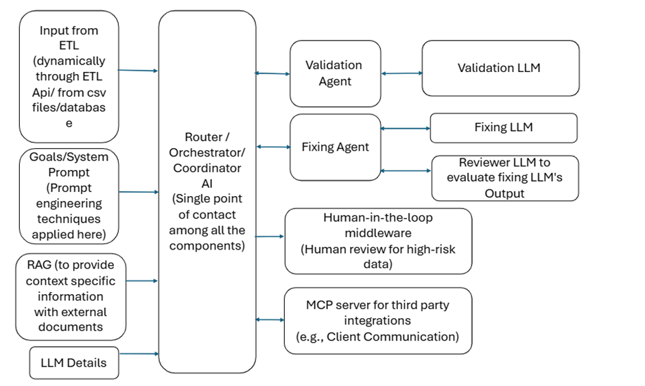

AI Automation Agent 

AI Automation Agent is a Proof-of-Concept project demonstrating AI-powered document processing and validation for our organization. It uses large language models (LLMs) and semantic embeddings to read, analyze, and validate document content automatically.

Purpose

Showcase how AI can automate document processing.
Validate customer or internal records efficiently.
Demonstrate integration of LLMs in internal workflows.

Overview

The project is designed to streamline document processing using AI. It supports reading CSV or text documents, breaking them into manageable chunks, embedding them for semantic understanding, and validating their content through AI-driven workflows.

This project demonstrates a full AI pipeline, from input ingestion to intelligent validation, and can serve as a foundation for larger automation systems or intelligent document processing workflows.

Features

Document Loading: Supports CSV and text files.

Chunking: Automatically splits documents into chunks for efficient AI processing.

Semantic Embeddings: Uses sentence-transformers/all-MiniLM-L6-v2 to convert text into embeddings for semantic understanding.

AI Validation and fix: Integrates LLMs to validate and fix document content against user-defined criteria.

AI Evaluation: Reflection based strict evaluation

Error Handling & Retry: Robust mechanisms to handle rate limits and temporary service errors.

Extensible Architecture: Built with modular LangGraph nodes for easy customization.

